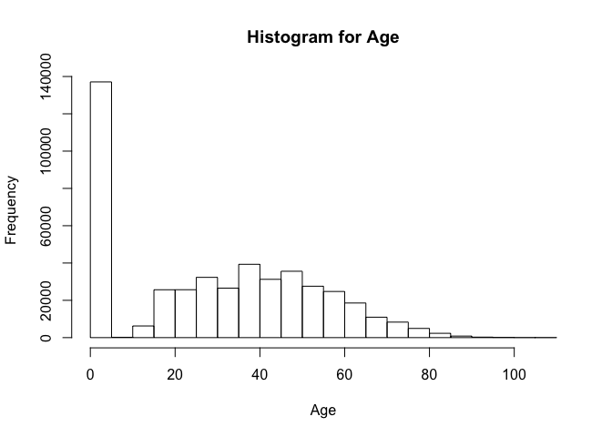
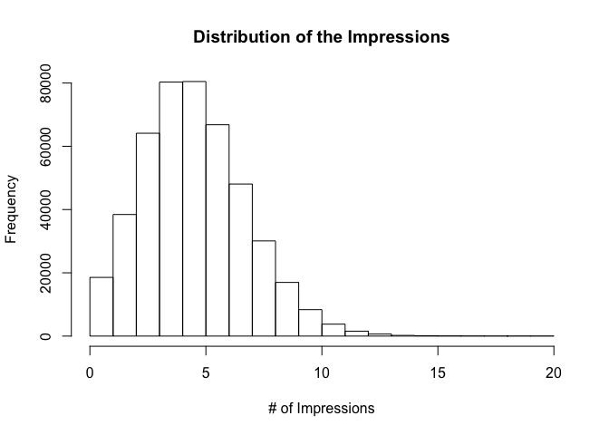
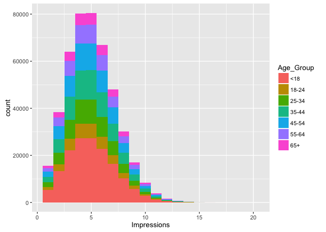
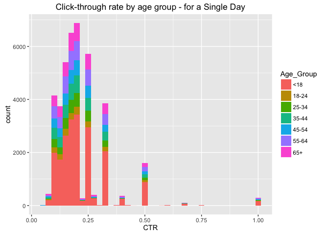
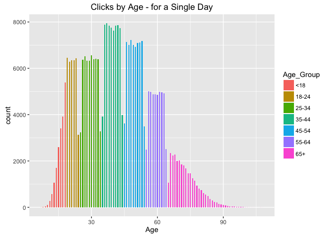

# Week 10 Live Session Assignment - Website Click Data
Ramesh Simhambhatla  
November 13, 2016  

# Introduction
The purpose of this report to is to produce code and output for Week10 Live Session Assignment on the WebSite Click Data. The data set used in nyt1.csv

####Load libraries used in this exercise

```r
library(plyr)
library(dplyr)
```

```
## 
## Attaching package: 'dplyr'
```

```
## The following objects are masked from 'package:plyr':
## 
##     arrange, count, desc, failwith, id, mutate, rename, summarise,
##     summarize
```

```
## The following objects are masked from 'package:stats':
## 
##     filter, lag
```

```
## The following objects are masked from 'package:base':
## 
##     intersect, setdiff, setequal, union
```

```r
library(data.table)
```

```
## -------------------------------------------------------------------------
```

```
## data.table + dplyr code now lives in dtplyr.
## Please library(dtplyr)!
```

```
## -------------------------------------------------------------------------
```

```
## 
## Attaching package: 'data.table'
```

```
## The following objects are masked from 'package:dplyr':
## 
##     between, last
```

```r
library(ggplot2) # used for visualizations
```
####Read the nyt1.csv from the columbia.edu site and store into a local data frame 'data1'

```r
fileLocation <- "http://stat.columbia.edu/~rachel/datasets/nyt1.csv"
data1 <- read.csv(url(fileLocation))
```

####Explore the data using head, str, and summary functions

```r
head(data1) # reads top6 observations
```

```
##   Age Gender Impressions Clicks Signed_In
## 1  36      0           3      0         1
## 2  73      1           3      0         1
## 3  30      0           3      0         1
## 4  49      1           3      0         1
## 5  47      1          11      0         1
## 6  47      0          11      1         1
```

```r
str(data1) # str stands for 'structure'
```

```
## 'data.frame':	458441 obs. of  5 variables:
##  $ Age        : int  36 73 30 49 47 47 0 46 16 52 ...
##  $ Gender     : int  0 1 0 1 1 0 0 0 0 0 ...
##  $ Impressions: int  3 3 3 3 11 11 7 5 3 4 ...
##  $ Clicks     : int  0 0 0 0 0 1 1 0 0 0 ...
##  $ Signed_In  : int  1 1 1 1 1 1 0 1 1 1 ...
```

```r
summary(data1) # summary of the variables
```

```
##       Age             Gender       Impressions         Clicks       
##  Min.   :  0.00   Min.   :0.000   Min.   : 0.000   Min.   :0.00000  
##  1st Qu.:  0.00   1st Qu.:0.000   1st Qu.: 3.000   1st Qu.:0.00000  
##  Median : 31.00   Median :0.000   Median : 5.000   Median :0.00000  
##  Mean   : 29.48   Mean   :0.367   Mean   : 5.007   Mean   :0.09259  
##  3rd Qu.: 48.00   3rd Qu.:1.000   3rd Qu.: 6.000   3rd Qu.:0.00000  
##  Max.   :108.00   Max.   :1.000   Max.   :20.000   Max.   :4.00000  
##    Signed_In     
##  Min.   :0.0000  
##  1st Qu.:0.0000  
##  Median :1.0000  
##  Mean   :0.7009  
##  3rd Qu.:1.0000  
##  Max.   :1.0000
```

```r
# distribution of the Age column
hist(data1$Age, main="Histogram for Age", xlab="Age")
```

<!-- -->

```r
range(data1$Age)
```

```
## [1]   0 108
```

```r
# distribution of the Impressions column
hist(data1$Impressions, main="Distribution of the Impressions", xlab="# of Impressions")
```

<!-- -->

```r
range(data1$Impressions)
```

```
## [1]  0 20
```
####Observation: About 40% of observation have Age=0, means Age not availble for those observations. The number of clicks are normally distributed in the range of 0 to 10.

####Create a new variable ageGroup that categorizes age into following groups: < 18, 18-24, 25-34, 35-44, 45-54, 55-64 and 65+.


```r
data1$Age_Group <- cut(data1$Age, c(-Inf, 18, 24, 34, 44, 54, 64, Inf))
levels(data1$Age_Group) <- c("<18", "18-24", "25-34", "35-44", "45-54", "55-64", "65+")
# Name the levels of 'Age_Group' for readability
head(data1)
```

```
##   Age Gender Impressions Clicks Signed_In Age_Group
## 1  36      0           3      0         1     35-44
## 2  73      1           3      0         1       65+
## 3  30      0           3      0         1     25-34
## 4  49      1           3      0         1     45-54
## 5  47      1          11      0         1     45-54
## 6  47      0          11      1         1     45-54
```

####Use sub set of data called **ImpSub** where Impressions > 0 in the data set.

```r
ImpSub <- subset(data1, Impressions>0) # create a subset for Impressions > 0
ImpSub$CTR <- ImpSub$Clicks/ImpSub$Impressions
head(ImpSub)
```

```
##   Age Gender Impressions Clicks Signed_In Age_Group        CTR
## 1  36      0           3      0         1     35-44 0.00000000
## 2  73      1           3      0         1       65+ 0.00000000
## 3  30      0           3      0         1     25-34 0.00000000
## 4  49      1           3      0         1     45-54 0.00000000
## 5  47      1          11      0         1     45-54 0.00000000
## 6  47      0          11      1         1     45-54 0.09090909
```

####Create a new variable called click-through-rate (CTR = click/impression). Use this ImpSub data set to do further analysis.

```r
# Define a new variable to segment users based on click -through- rate (CTR) behavior.
# CTR< 0.2, 0.2<=CTR <0.4, 0.4<= CTR<0.6, 0.6<=CTR<0.8, CTR>0.8
ImpSub$CTRSeg <- cut(ImpSub$CTR, c(-Inf, 0.2, 0.4, 0.6, 0.8, Inf))
levels(ImpSub$CTRSeg) <- c("0.0-0.2", "0.2-0.4", "0.4-0.6", "0.6-0.8", "0.8-0.1")
head(ImpSub)
```

```
##   Age Gender Impressions Clicks Signed_In Age_Group        CTR  CTRSeg
## 1  36      0           3      0         1     35-44 0.00000000 0.0-0.2
## 2  73      1           3      0         1       65+ 0.00000000 0.0-0.2
## 3  30      0           3      0         1     25-34 0.00000000 0.0-0.2
## 4  49      1           3      0         1     45-54 0.00000000 0.0-0.2
## 5  47      1          11      0         1     45-54 0.00000000 0.0-0.2
## 6  47      0          11      1         1     45-54 0.09090909 0.0-0.2
```

####Get the total number of Male, Impressions, Clicks and Signed_In (0=Female, 1=Male)

```r
ImpSubMale <- subset(ImpSub, ImpSub$Gender==1) # create a subset for Gender = 1(Male)
sapply(ImpSubMale[, 2:5], sum) # output sum for columns 2 through 5
```

```
##      Gender Impressions      Clicks   Signed_In 
##      167146      842777       11777      167146
```

####Get the mean of Age, Impressions, Clicks, CTR and percentage of males and signed_In

```r
sapply(ImpSub[,c(1,3,4,7)], mean) # mean of Age, Impressions, Clicks, CTR
```

```
##         Age Impressions      Clicks         CTR 
## 29.48400988  5.04102992  0.09321768  0.01847053
```

```r
pcntMales <- length(ImpSubMale$Gender)/length(ImpSub$Gender) # calculate percentage of Males
pcntMales # print percentage of Males
```

```
## [1] 0.3670513
```

```r
ImpSubSignedIn <- subset(ImpSub, ImpSub$Signed_In==1) # create subset for signed_in = 1 data
pcntSignedIn <- length(ImpSubSignedIn$Signed_In)/length(ImpSub$Signed_In) # calculate the percent signed_in
pcntSignedIn # output percent Signed In
```

```
## [1] 0.7009564
```

```r
#summarise to print consolidted data for mean and percentages 
summarise(ImpSub, mean(Age), mean(Impressions), mean(Clicks), mean(CTR), pcntMales, pcntSignedIn)
```

```
##   mean(Age) mean(Impressions) mean(Clicks)  mean(CTR) pcntMales
## 1  29.48401           5.04103   0.09321768 0.01847053 0.3670513
##   pcntSignedIn
## 1    0.7009564
```
####Get the means of Impressions, Clicks, CTR and percentage of males and signed_In  by AgeGroup.

```r
dataVByAgeGroup <- ImpSub %>% 
  group_by(Age_Group) %>% 
  summarise(Impressions=mean(Impressions), CTR=mean(CTR), Clicks=mean(Clicks), 
            pctSigned=sum(Signed_In==1)/length(Age_Group),
            pctMales=sum(Gender==1)/length(Age_Group))

dataVByAgeGroup
```

```
NA
##   Age_Group Impressions         CTR     Clicks pctSigned  pctMales
##      <fctr>       <dbl>       <dbl>      <dbl>     <dbl>     <dbl>
## 1       <18    5.033534 0.028141310 0.14167788 0.1231528 0.0790648
## 2     18-24    5.043240 0.009720481 0.04880905 1.0000000 0.5339864
## 3     25-34    5.026055 0.010146329 0.05081227 1.0000000 0.5319977
## 4     35-44    5.054749 0.010286330 0.05202148 1.0000000 0.5317072
## 5     45-54    5.045172 0.009957612 0.05062260 1.0000000 0.5292192
## 6     55-64    5.053484 0.020306816 0.10246952 1.0000000 0.5359633
## 7       65+    5.046925 0.029802702 0.15233226 1.0000000 0.3632512
```
####Create a table of CTRGroup vs AgeGroup counts.

```r
countAgeGroup <- as.data.table(ddply(ImpSub, .(Age_Group), nrow))
names(countAgeGroup)[2] <- "countAgeGroup"
countAgeGroup
```

```
##    Age_Group countAgeGroup
## 1:       <18        155303
## 2:     18-24         35014
## 3:     25-34         57801
## 4:     35-44         70394
## 5:     45-54         63845
## 6:     55-64         44462
## 7:       65+         28556
```

```r
countCTRGroup <- as.data.table(ddply(ImpSub, .(CTRSeg), nrow))
names(countCTRGroup)[2] <- "countCTRGroup"
countCTRGroup
```

```
##     CTRSeg countCTRGroup
## 1: 0.0-0.2        442700
## 2: 0.2-0.4         10623
## 3: 0.4-0.6          1647
## 4: 0.6-0.8           106
## 5: 0.8-0.1           299
```

```r
mergeCounts <- rbind(countCTRGroup, countAgeGroup, fill=TRUE)
mergeCounts
```

```
##      CTRSeg countCTRGroup Age_Group countAgeGroup
##  1: 0.0-0.2        442700        NA            NA
##  2: 0.2-0.4         10623        NA            NA
##  3: 0.4-0.6          1647        NA            NA
##  4: 0.6-0.8           106        NA            NA
##  5: 0.8-0.1           299        NA            NA
##  6:      NA            NA       <18        155303
##  7:      NA            NA     18-24         35014
##  8:      NA            NA     25-34         57801
##  9:      NA            NA     35-44         70394
## 10:      NA            NA     45-54         63845
## 11:      NA            NA     55-64         44462
## 12:      NA            NA       65+         28556
```

#### Plot distributions of number impressions and click-through-rate (CTR = click/impression) for the age groups

```r
ggplot(subset(ImpSub, Impressions>0), aes(x=Impressions, fill=Age_Group)) +
  geom_histogram(binwidth=1)
```

<!-- -->

```r
ggplot(subset(ImpSub, CTR>0), aes(x=CTR, fill=Age_Group)) +
  labs(title="Click-through rate by age group - for a Single Day") +
  geom_histogram(binwidth=.025)
```

<!-- -->

```r
# Histogram of Clicks by Age
ggplot(subset(ImpSub, Age>0), aes(x=Age, fill=Age_Group)) +
  labs(title="Clicks by Age - for a Single Day") +
  geom_histogram(binwidth=0.5)
```

<!-- -->
####**** End of File ****
