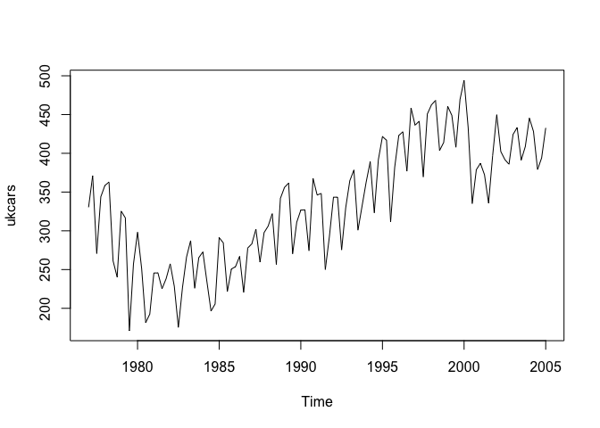
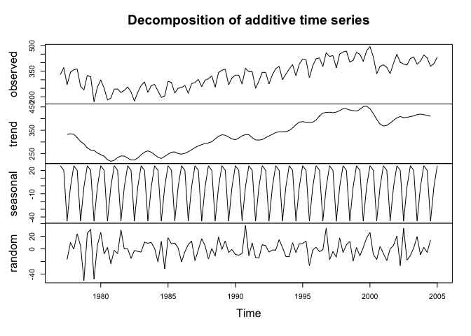
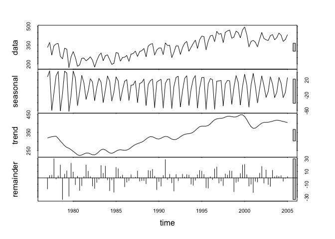
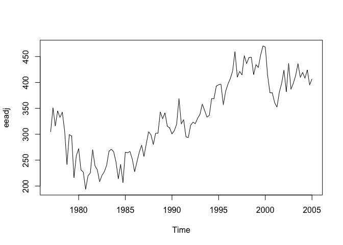
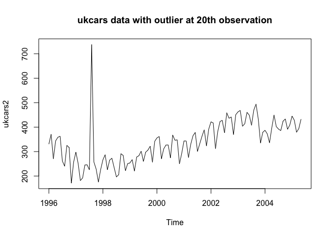
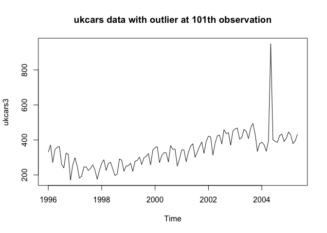
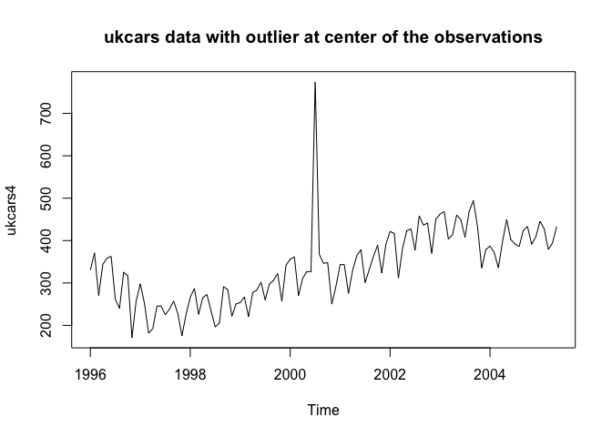
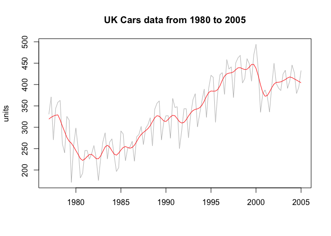

# UKCarsAssignment
Ramesh Simhambhatla  
November 19, 2016  

#Introduction
The following exercise is to demonstrate the using and analyzing ukcars timeseries data using fpp package

### Install and load 'fpp' package

```r
#install.packages("fpp")
library(fpp)
```

```
## Loading required package: forecast
```

```
## Loading required package: zoo
```

```
## 
## Attaching package: 'zoo'
```

```
## The following objects are masked from 'package:base':
## 
##     as.Date, as.Date.numeric
```

```
## Loading required package: timeDate
```

```
## This is forecast 7.3
```

```
## Loading required package: fma
```

```
## Loading required package: tseries
```

```
## Loading required package: expsmooth
```

```
## Loading required package: lmtest
```

```r
# read 'ukdata' timeseries data
data(ukcars)
```

### a)	Plot the time series. Can you identify seasonal fluctuations and/or a trend? 

```r
plot(ukcars)
```

<!-- -->

ukcars data shows a linear uptrend with predictable seasonal fluctuations from 1980 to 2000, breaking the linear downtrend around 1980. The data shows a sudden drop in 2000, but resumes the uptrend till 2005 - the seasonal trends remain same despite the broken trends at 1980 and 2000.

###b)	Use a classical decomposition to calculate the trend-cycle and seasonal indices.

```r
fitd <- decompose(ukcars)
plot(fitd)
```

<!-- -->

Seasonal trends shows very consistent pattern, ranges between -40 and 10, however the trend cycle show a linear uptrend with a change in patterns couple of times, and with some fluctuations (peaks and troughs)

###c)	Do the results support the graphical interpretation from part (a)? 

```r
fit <- stl(ukcars, s.window=5)
plot(fit)
```

<!-- -->

Yes, the results mostly support the graphical interpretation of the original plot. The graphs shows
seasonal fluctuations with linear upward trend between 1980 and 2000. 

###d)	Compute and plot the seasonally adjusted data. 

```r
eeadj <- seasadj(fitd)
plot(eeadj)
```

<!-- -->

###e) Change one observation to be an outlier (e.g., add 500 to one observation), and 
recompute the seasonally adjusted data. What is the effect of the outlier? 

```r
ukcars2 <- ts(c(ukcars[1:19],ukcars[20]+500,ukcars[21:113]),start=c(1996,1),frequency=12)
plot(ukcars2, main="ukcars data with outlier at 20th observation")
```

<!-- -->

```r
ukcars3 <- ts(c(ukcars[1:100],ukcars[101]+500,ukcars[102:113]),start=c(1996,1),frequency=12)
plot(ukcars3, main="ukcars data with outlier at 101th observation")
```

<!-- -->

###f)	Does it make any difference if the outlier is near the end rather than in the middle of the time series? 

```r
ukcars4 <- ts(c(ukcars[1:54],ukcars[55]+500,ukcars[56:113]),start=c(1996,1),frequency=12)
plot(ukcars4, main="ukcars data with outlier at center of the observations")
```

<!-- -->

The outlier skewed the seasonal pattern more narrower and consistent range. No significant difference observed with overall trends whether the outlier at start, middle or end of the series.


```r
plot(ukcars, col="gray",
     main="UK Cars data from 1980 to 2005", ylab="units", xlab="")
lines(fit$time.series[,2],col="red",ylab="Trend")
```

<!-- -->

The final plot shows a depiction of the trend line ofthe timeseries data.

### * End of File ***
