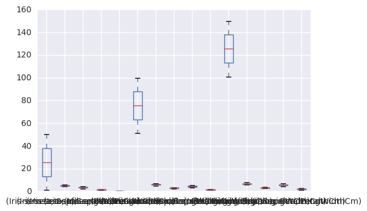
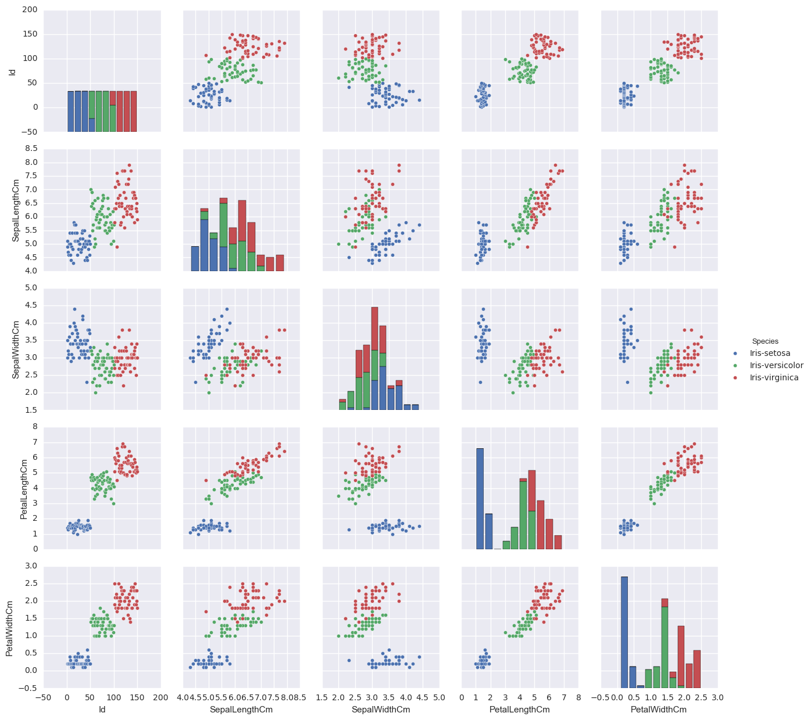

## Author: Ramesh Simhambhatla
## Date: 11/24/2016

## Week 13 Python Assignment 1

##### Create a list named my_list in python with the following data points - 45.4 44.2 36.8 35.1 39.0 60.0 47.4 41.1 45.8 35.6


```python
my_list = [45.4, 44.2, 36.8, 35.1, 39.0, 60.0, 47.4, 41.1, 45.8, 35.6]
print ("my list is: ", my_list)
```

    my list is:  [45.4, 44.2, 36.8, 35.1, 39.0, 60.0, 47.4, 41.1, 45.8, 35.6]


##### a. Print the 5th element in the list


```python
print ("Print 5th element: ", my_list[4])
```

    Print 5th element:  39.0


##### b. Append 55.2 to my_list


```python
my_list.append(55.2)
print ("my list is: ", my_list)
```

    my list is:  [45.4, 44.2, 36.8, 35.1, 39.0, 60.0, 47.4, 41.1, 45.8, 35.6, 55.2]


##### c. Remove the 6th element in the list


```python
my_list.remove(my_list[5])
print ("my list is: ", my_list)
```

    my list is:  [45.4, 44.2, 36.8, 35.1, 39.0, 47.4, 41.1, 45.8, 35.6, 55.2]


##### d. Iterate over the list to print data points greater than 45


```python
for i in range(0, len(my_list)-1):
    if my_list[i] > 45:
        print("print element >45 : ",i,"th value: ", my_list[i])
```

    print element >45 :  0 th value:  45.4
    print element >45 :  5 th value:  47.4
    print element >45 :  7 th value:  45.8


## Week 13 Python Assignment 2 - Introduction to numpy

##### a.Import the numpy library using the following command – import nump


```python
import numpy as np
```

##### b.Declare numpy array with the same data points as in my_list using numpy.array()


```python
npArray = np.array([45.4, 44.2, 36.8, 35.1, 39.0, 60.0, 47.4, 41.1, 45.8, 35.6])
print(npArray)
```

    [ 45.4  44.2  36.8  35.1  39.   60.   47.4  41.1  45.8  35.6]


###### c. Compute the mean and standard deviation using numpy.mean() and numpy.std() of the above array


```python
print("Mean of the Array: ","%.2f" %  np.mean(npArray))
print("Standard Deviation of the Array: ", "%.2f" % np.std(npArray))
```

    Mean of the Array:  43.04
    Standard Deviation of the Array:  7.06


##### d. Use logical referencing to get only those values that are less than 45


```python
print("Values > 45 :", ["%0.1f" % x for x in npArray if x>45])
```

    Values > 45 : ['45.4', '60.0', '47.4', '45.8']


##### e.	Compute the max and min of the array using numpy.max() and numpy.min()


```python
print("Min. of the Array: ", np.min(npArray))
print("Max. of the Array: ", np.max(npArray))
```

    Min. of the Array:  35.1
    Max. of the Array:  60.0


## Week13 Python Assignment 3 - Introduction to pandas

##### a.Import the pandas library – import pandas


```python
import pandas
```

##### b.	Read the IRIS dataset into iris using pandas.read_csv().


```python
iris = pandas.read_csv("https://dl.dropboxusercontent.com/u/56150821/Iris.csv")
```

##### c.Using iris.head(), display the head of the dataset


```python
print(iris.head())
```

       Id  SepalLengthCm  SepalWidthCm  PetalLengthCm  PetalWidthCm      Species
    0   1            5.1           3.5            1.4           0.2  Iris-setosa
    1   2            4.9           3.0            1.4           0.2  Iris-setosa
    2   3            4.7           3.2            1.3           0.2  Iris-setosa
    3   4            4.6           3.1            1.5           0.2  Iris-setosa
    4   5            5.0           3.6            1.4           0.2  Iris-setosa


##### d. Use DataFrame.drop() to drop the id column


```python
iris_noid = iris.drop(iris.columns[0], axis=1)
print(iris_noid.head())
```

       SepalLengthCm  SepalWidthCm  PetalLengthCm  PetalWidthCm      Species
    0            5.1           3.5            1.4           0.2  Iris-setosa
    1            4.9           3.0            1.4           0.2  Iris-setosa
    2            4.7           3.2            1.3           0.2  Iris-setosa
    3            4.6           3.1            1.5           0.2  Iris-setosa
    4            5.0           3.6            1.4           0.2  Iris-setosa


##### e. Subset dataframe to create a new data frame that includes only the measurements for the setosa species


```python
iris_sub = iris[['SepalLengthCm', 'SepalWidthCm', 'PetalLengthCm', 'PetalWidthCm']]
print(iris_sub.head())
```

       SepalLengthCm  SepalWidthCm  PetalLengthCm  PetalWidthCm
    0            5.1           3.5            1.4           0.2
    1            4.9           3.0            1.4           0.2
    2            4.7           3.2            1.3           0.2
    3            4.6           3.1            1.5           0.2
    4            5.0           3.6            1.4           0.2


##### f.Use DataFrame.describe() to get the summary statistics


```python
print(iris_sub.describe())
```

           SepalLengthCm  SepalWidthCm  PetalLengthCm  PetalWidthCm
    count     150.000000    150.000000     150.000000    150.000000
    mean        5.843333      3.054000       3.758667      1.198667
    std         0.828066      0.433594       1.764420      0.763161
    min         4.300000      2.000000       1.000000      0.100000
    25%         5.100000      2.800000       1.600000      0.300000
    50%         5.800000      3.000000       4.350000      1.300000
    75%         6.400000      3.300000       5.100000      1.800000
    max         7.900000      4.400000       6.900000      2.500000


##### g.Use DataFrame.groupby() to create grouped data frames by Species and compute summary statistics using DataFrame.describe()


```python
iris_group = iris.groupby('Species')
print(iris_group.describe())
```

                                  Id  PetalLengthCm  PetalWidthCm  SepalLengthCm  \
    Species                                                                        
    Iris-setosa     count   50.00000      50.000000     50.000000      50.000000   
                    mean    25.50000       1.464000      0.244000       5.006000   
                    std     14.57738       0.173511      0.107210       0.352490   
                    min      1.00000       1.000000      0.100000       4.300000   
                    25%     13.25000       1.400000      0.200000       4.800000   
                    50%     25.50000       1.500000      0.200000       5.000000   
                    75%     37.75000       1.575000      0.300000       5.200000   
                    max     50.00000       1.900000      0.600000       5.800000   
    Iris-versicolor count   50.00000      50.000000     50.000000      50.000000   
                    mean    75.50000       4.260000      1.326000       5.936000   
                    std     14.57738       0.469911      0.197753       0.516171   
                    min     51.00000       3.000000      1.000000       4.900000   
                    25%     63.25000       4.000000      1.200000       5.600000   
                    50%     75.50000       4.350000      1.300000       5.900000   
                    75%     87.75000       4.600000      1.500000       6.300000   
                    max    100.00000       5.100000      1.800000       7.000000   
    Iris-virginica  count   50.00000      50.000000     50.000000      50.000000   
                    mean   125.50000       5.552000      2.026000       6.588000   
                    std     14.57738       0.551895      0.274650       0.635880   
                    min    101.00000       4.500000      1.400000       4.900000   
                    25%    113.25000       5.100000      1.800000       6.225000   
                    50%    125.50000       5.550000      2.000000       6.500000   
                    75%    137.75000       5.875000      2.300000       6.900000   
                    max    150.00000       6.900000      2.500000       7.900000   
    
                           SepalWidthCm  
    Species                              
    Iris-setosa     count     50.000000  
                    mean       3.418000  
                    std        0.381024  
                    min        2.300000  
                    25%        3.125000  
                    50%        3.400000  
                    75%        3.675000  
                    max        4.400000  
    Iris-versicolor count     50.000000  
                    mean       2.770000  
                    std        0.313798  
                    min        2.000000  
                    25%        2.525000  
                    50%        2.800000  
                    75%        3.000000  
                    max        3.400000  
    Iris-virginica  count     50.000000  
                    mean       2.974000  
                    std        0.322497  
                    min        2.200000  
                    25%        2.800000  
                    50%        3.000000  
                    75%        3.175000  
                    max        3.800000  


##### h. Use DataFrame.boxplot() to plot boxplots by Species


```python
iris_group.boxplot('Species', return_type='axes')
```


    <matplotlib.axes._subplots.AxesSubplot at 0x125500048>





##### i.Plot a scatter matrix plot using the seaborn library. Use the following to load and plot 


```python
import seaborn as sns
```


```python
sns.pairplot(iris, hue='Species')
```


    <seaborn.axisgrid.PairGrid at 0x12571e2e8>





### End of File
